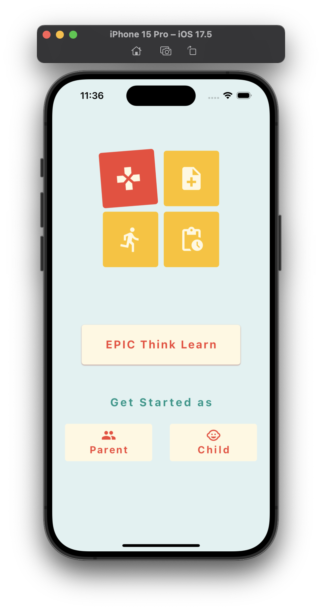

# Interm Demo Report
Submitted by: Hrutuja Patnekar, John Nixon, Xiaofan Mi

## Introduction
This report outlines the progress and key features demonstrated in our recent intern demo to our supervisor. The demo showcased the development and functionality of our platform, EPIC app.

## Key Features Discussed

### 1. User Registration
- **Overview**: We demonstrated the user registration process, highlighting its user-friendly interface and secure data handling.
- **Features**:
  - Simple and intuitive registration form.
  - Validation checks to ensure data integrity.
  - Secure storage of user credentials.

### 2. Strengths and Weaknesses Questionnaire
- **Overview**: The questionnaire is designed to assess users' strengths and weaknesses to tailor personalized strategies.
- **Features**:
  - Comprehensive set of questions covering various aspects.
  - Real-time feedback and analysis.
  - Secure handling of user responses.

### 3. Tailoring of Strategies
- **Overview**: Based on the questionnaire results, the app tailors strategies to meet individual user needs.
- **Features**:
  - Customizable strategies based on user inputs.
  - Dynamic adjustment of strategies over time.
  - User-friendly interface for viewing and updating strategies.

### 4. Brief Account and Home Screen Functionalities
- **Overview**: We provided a brief overview of the account management features and home screen functionalities.
- **Features**:
  - Easy access to account settings and personal information.
  - Home screen displaying key metrics and notifications.
  - Navigation to various sections of the app.

## GitHub Repository
- **Link**: [GitHub Repository](https://github.com/JohnNixon6972/EPIC-Think-Learn.git)

## Attachments
- **Images**: 
<table>
  <tr>
    <td></td>
    <td></td>
    <td></td>
    <td></td>
  </tr>
</table>̦
